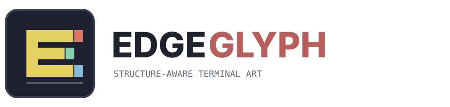
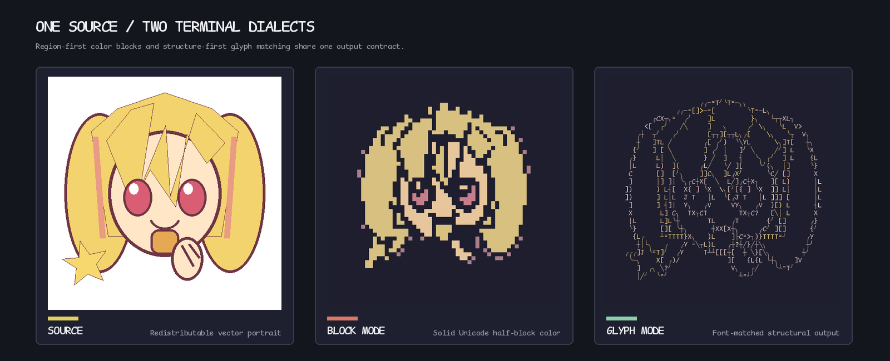
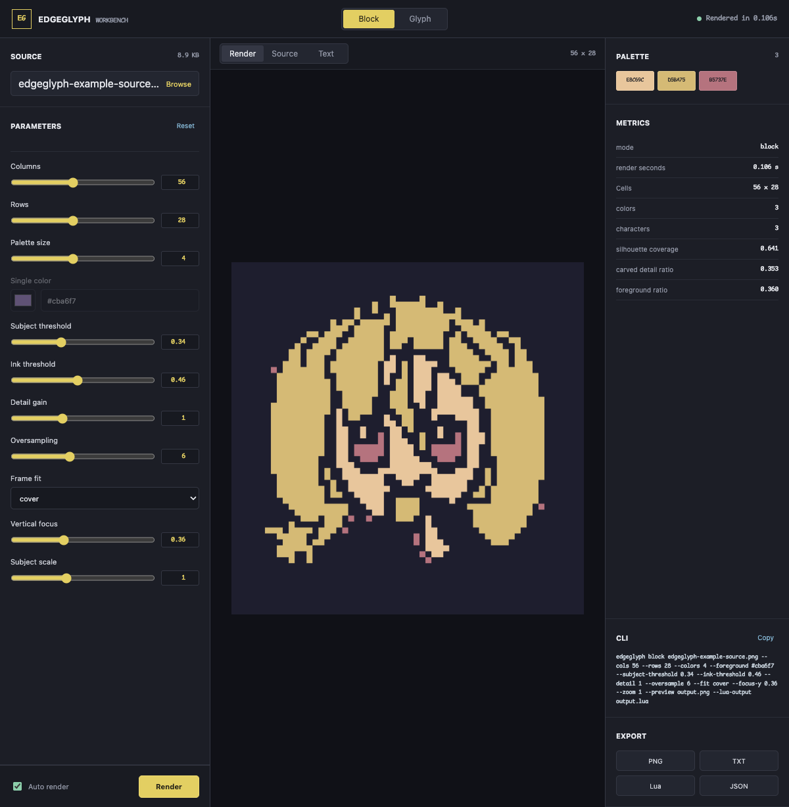

<p align="center"><picture><source media="(prefers-color-scheme: dark)" srcset="docs/assets/edgeglyph-logo-dark.svg"></picture></p>

<p align="center">
  Convert images into terminal-native block art or font-matched glyph art.<br>
  One rendering contract for the CLI, Python API, NvDash, and a local visual workbench.
</p>

<p align="center">
  <a href="https://github.com/BITnene465/edgeglyph/actions/workflows/ci.yml"></a>
  
  <a href="LICENSE"></a>
  
</p>

<p align="center"></p>

## Why EdgeGlyph

Most image-to-ASCII tools map brightness to a character ramp. EdgeGlyph separates two different visual
problems instead of forcing both through one heuristic:

- **Block mode is region-first.** It preserves filled shapes and source color using spaces plus Unicode
  `▀▄█`, with two independently colored vertical pixels per terminal cell.
- **Glyph mode is structure-first.** It extracts edges, rasterizes the requested terminal font, matches
  local geometry, and optimizes line continuity across the full grid.

Both modes return the same result model and support plain text, color PNG, NvDash Lua, debug images, and
JSON metrics. Public parameters live in one schema, so the CLI and browser controls cannot silently drift.

## Use cases

### Terminal dashboards and editor headers

Block mode produces stable, low-resolution artwork for NvChad, NvDash, terminal launch screens, README
headers, and CLI status views. Adaptive OKLab palette grading keeps the result legible on dark backgrounds.

### Structural ASCII and font experiments

Glyph mode is useful when the character shapes themselves should remain visible: font comparisons,
structure studies, compact monochrome artwork, and terminal output where block cells are not desired.

### Interactive tuning and export

The local workbench exposes every mode parameter as a bounded slider, color control, or dropdown. It shows
the equivalent CLI command and exports PNG, UTF-8 text, NvDash Lua, and JSON without retaining uploads.

<p align="center"></p>

## Quick start

EdgeGlyph requires Python 3.10 or newer and has only two runtime dependencies: NumPy and Pillow.

```bash
git clone https://github.com/BITnene465/edgeglyph.git
cd edgeglyph
python3 -m venv .venv
source .venv/bin/activate
pip install -e .
```

Start the local workbench:

```bash
edgeglyph web
```

It opens `http://127.0.0.1:8765` and only accepts loopback bindings.

## CLI

The CLI is organized around explicit modes so unrelated arguments never appear in the same command.

```text
edgeglyph block  SOURCE [frame] [block controls] [output]
edgeglyph glyph  SOURCE --font FONT [frame] [glyph controls] [output]
edgeglyph web    [--port PORT] [--no-open]
edgeglyph schema
```

### Block mode

```bash
edgeglyph block input.png \
  --cols 72 --rows 24 \
  --colors 4 \
  --fit cover --focus-y 0.36 --zoom 0.9 \
  --output output.txt \
  --preview output.png \
  --lua-output dashboard_art.lua \
  --metrics metrics.json
```

| Argument | Purpose | Default |
| --- | --- | ---: |
| `--colors` | Maximum adaptive palette size | `4` |
| `--subject-threshold` | Pooled coverage retained as subject | `0.34` |
| `--ink-threshold` | Strength required to carve interior line art | `0.46` |
| `--detail` | Local-contrast contribution to carved detail | `1.0` |
| `--oversample` | Samples along each terminal-pixel axis | `6` |
| `--fit` | `cover` the frame or `contain` the complete source | `cover` |
| `--focus-y` | Vertical crop anchor from top to bottom | `0.36` |
| `--zoom` | Subject scale inside the terminal frame | `1.0` |
| `--foreground` | Fixed color when `--colors 1` | `#cba6f7` |

### Glyph mode

```bash
edgeglyph glyph input.png \
  --font /path/to/ComicMono.ttf \
  --fallback-font /path/to/MapleMono-NF-Regular.ttf \
  --cols 56 --rows 28 \
  --fill-mode none \
  --output output.txt \
  --preview output.png
```

| Argument | Purpose | Default |
| --- | --- | ---: |
| `--colors` | Maximum adaptive palette size | `16` |
| `--top-k` | Candidate glyphs retained per cell | `8` |
| `--min-luminance` | Minimum graded palette luminance | `0.72` |
| `--fill-mode` | `none`, `salient`, or `tone` filling | `none` |
| `--continuity` | Adjacent-cell stroke continuity weight | `0.4` |
| `--diversity` | Penalty for repeated similar glyphs | `1.5` |
| `--line-renderer` | Terminal `sprite` or fallback `font` geometry | `sprite` |

Run `edgeglyph block --help`, `edgeglyph glyph --help`, or `edgeglyph schema` for the complete validated
interface. The pre-0.4 form `edgeglyph input.png --style block ...` remains compatible.

## Outputs

| Argument | Result |
| --- | --- |
| `-o`, `--output` | Plain UTF-8 terminal art |
| `--lua-output` | Palette, rows, and foreground/background chunks for NvDash |
| `--preview` | Color PNG preview |
| `--metrics` | JSON render metrics |
| `--debug-dir` | Mode-specific intermediate masks and edges |

When `--output` is omitted, art is written to stdout. Metrics are always written to stderr, allowing clean
shell redirection and pipelines.

## Python API

```python
from edgeglyph.modes import block

result = block.render(
    "input.png",
    cols=72,
    rows=24,
    colors=4,
    fit="cover",
    zoom=0.9,
)

print("\n".join(result.lines))
```

The legacy imports in `edgeglyph.engine` remain available, but new integrations should use
`edgeglyph.modes.block` or `edgeglyph.modes.glyph`.

## How it works

```text
Image
  ├─ block → background flood → region pooling → detail carving → OKLab palette → ▀▄█
  └─ glyph → Scharr edges → thinning → font rasterization → Chamfer scoring → grid optimization
                                                                    ↓
                                         text / PNG / Lua / metrics / debug layers
```

See [docs/architecture.md](docs/architecture.md) for package boundaries and workbench security notes.

## Development

```bash
python -m unittest discover -s tests -v
python -m compileall -q src
python -m build
```

The test suite covers geometry primitives, block color boundaries, font-matched rendering, schema
validation, CLI compatibility, and all workbench download formats. See [CONTRIBUTING.md](CONTRIBUTING.md)
before changing renderer defaults or adding public arguments.

## References

- [X. Xu, L. Zhang, and T.-T. Wong, "Structure-based ASCII Art," ACM Transactions on Graphics, 2010](https://doi.org/10.1145/1778765.1778789)
- [M. Chung and T. Kwon, "Fast Text Placement Scheme for ASCII Art Synthesis," IEEE Access, 2022](https://doi.org/10.1109/ACCESS.2022.3167567)

## License

[MIT](LICENSE)
