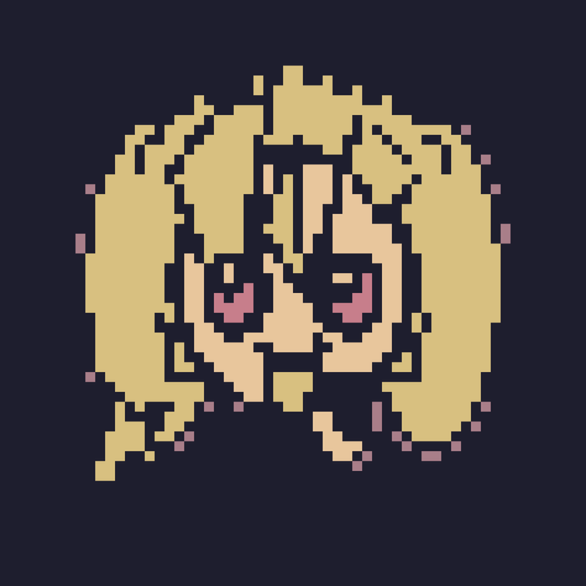

# EdgeGlyph

EdgeGlyph converts images into terminal-native artwork. Its primary block renderer produces solid,
palette-quantized pixel art with Unicode half blocks. A separate glyph renderer matches source edges against
the actual terminal font for conventional ASCII-style output.



The renderer is designed for terminal dashboards, README artwork, and other low-resolution text surfaces.
Block output uses only spaces and `▀▄█`, so its shapes remain stable across terminals that render Unicode
block elements correctly.

## Why

Most image-to-ASCII tools map brightness to visible characters. That is useful for dense photographs, but
it does not create the flat, filled pixel-art style used by many terminal dashboards. EdgeGlyph's default
block pipeline instead:

1. Crops or contains the source at the terminal's physical aspect ratio.
2. Removes only near-white background connected to the image boundary.
3. Builds a filled subject silhouette.
4. Uses luminance, local contrast, and saturation to carve line art and facial detail from that silhouette.
5. Quantizes source colors in OKLab space and grades the palette for dark terminal backgrounds.
6. Pools the result into two independently colored vertical pixels per terminal cell.
7. Encodes each cell as a space, upper half block, lower half block, or full block.

The optional glyph pipeline uses Scharr edges, thinning, orientation-aware Chamfer distance, continuity
optimization, and actual font rasterization. Both renderers depend only on NumPy and Pillow.

## Install

```bash
python3 -m venv .venv
source .venv/bin/activate
pip install -e .
```

## Usage

```bash
edgeglyph input.png \
  --style block \
  --colors 4 \
  --cols 72 --rows 24 \
  --fit cover --focus-y 0.36 --zoom 0.9 \
  --output output.txt \
  --preview output.png
```

For an NvChad/NvDash header:

```bash
edgeglyph input.png \
  --style block \
  --lua-output dashboard_art.lua \
  --preview dashboard_art.png
```

Block controls:

- `--fit cover`: fills the requested frame and crops excess source area.
- `--fit contain`: keeps the complete source and leaves empty margins where needed.
- `--focus-y`: moves the crop toward the top or bottom of the source.
- `--zoom`: scales the subject inside the frame without changing terminal dimensions.
- `--colors`: sets the maximum adaptive palette size; perceptually redundant colors are merged.
- `--subject-threshold`: controls the outer silhouette coverage threshold.
- `--ink-threshold`: controls how aggressively dark line art is carved from the silhouette.
- `--foreground`: sets a fixed color when `--colors 1` is requested.

For font-matched glyph art:

```bash
edgeglyph input.png \
  --style glyph \
  --font /path/to/PrimaryMono.ttf \
  --fallback-font /path/to/NerdFont.ttf \
  --cols 56 --rows 28 \
  --output output.txt
```

Glyph controls:

- `--fill-mode none`: structure-only output; best for compact portraits and dashboard headers.
- `--fill-mode salient`: adds sparse tone glyphs to dark, saturated regions.
- `--fill-mode tone`: combines structural edges with general halftone filling.
- `--continuity`: strength of adjacent-cell line continuity.
- `--diversity`: discourages a few similar glyphs from dominating the image.
- `--line-renderer sprite`: models geometric box-drawing sprites used by terminals such as Ghostty.
- `--line-renderer font`: rasterizes box-drawing characters from the requested fallback font instead.
- `--debug-dir`: writes source edges, subject mask, importance map, and reconstructed glyph edges.

## Glyph Metrics

EdgeGlyph reports bidirectional edge precision, recall, F1, and Chamfer distance. These metrics do not
replace visual inspection, but they make regressions in structural fidelity measurable.

On a development portrait, with the actual terminal font and a `56x28` grid:

| Renderer | Edge F1 | Chamfer distance |
| --- | ---: | ---: |
| Tone-oriented terminal renderer | 0.252 | 7.99 |
| EdgeGlyph structure preset | 0.707 | 1.77 |

Lower Chamfer distance is better. The development portrait is not included in this repository. Block mode
reports silhouette coverage, carved-detail ratio, and foreground ratio instead. These are descriptive
signals for tuning a binary region, not claims about perceptual similarity.

## Development

```bash
python -m unittest discover -s tests -v
python -m compileall -q src
```

## References

- [X. Xu, L. Zhang, and T.-T. Wong, "Structure-based ASCII Art," ACM Transactions on Graphics, 2010](https://doi.org/10.1145/1778765.1778789).
- [M. Chung and T. Kwon, "Fast Text Placement Scheme for ASCII Art Synthesis," IEEE Access, 2022](https://doi.org/10.1109/ACCESS.2022.3167567).

## License

MIT
