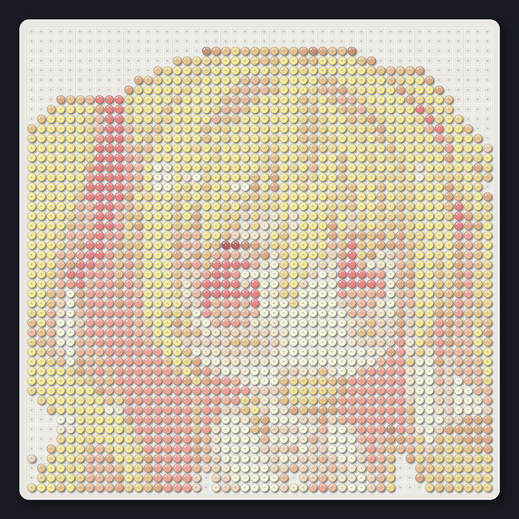
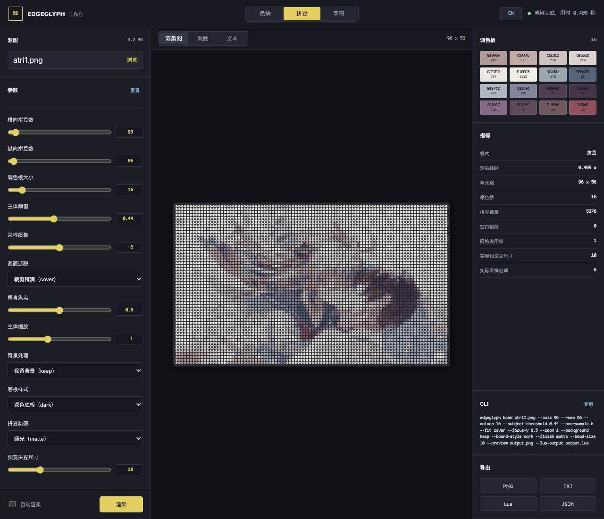

<p align="center"><picture><source media="(prefers-color-scheme: dark)" srcset="docs/assets/edgeglyph-logo-dark.svg"></picture></p>

<p align="center"><a href="README.md">English</a> · <strong>简体中文</strong></p>

<p align="center">
  将图像转换为终端原生色块画、字体匹配字符画或实体拼豆图纸。<br>
  CLI、Python API、NvDash 与本地可视化工作台共享同一套渲染接口。
</p>

<p align="center">
  <a href="https://github.com/BITnene465/edgeglyph/actions/workflows/ci.yml"></a>
  
  <a href="LICENSE"></a>
  
</p>

<p align="center"></p>

主展示图使用 [`docs/assets/shinku02.jpg`](docs/assets/shinku02.jpg) 作为同一源图，因此不同结果之间的差异来自渲染策略，而不是输入素材。后文使用第二张横向源图演示更高分辨率的拼豆网格。

## 为什么选择 EdgeGlyph

大多数图像转 ASCII 工具只按亮度映射字符。EdgeGlyph 将需求拆分为三个不同的视觉问题，避免用同一种启发式算法勉强处理所有图像：

- **色块模式以区域为核心。** 使用空格和 Unicode `▀▄█` 保存实心轮廓与源图颜色，每个终端单元格可以容纳上下两个独立着色的像素。
- **字符模式以结构为核心。** 提取图像边缘，栅格化指定终端字体，匹配局部几何结构，并在完整网格上优化线条连续性。
- **拼豆模式以单元格为核心。** 为正方形网格中的每个位置分配一种实体颜色，移除空白背景，并按照真实拼豆几何结构生成高分辨率底板预览。

所有模式使用相同的结果模型，均可输出纯文本、彩色 PNG、NvDash Lua、调试图层和 JSON 指标。所有公开参数来自同一份 schema，CLI 与浏览器控件不会悄然产生差异。

## 使用场景

### 终端仪表盘与编辑器封面

色块模式适合为 NvChad、NvDash、终端启动页、README 头图和 CLI 状态界面生成稳定的低分辨率图像。自适应 OKLab 调色板会调整颜色层级，使结果在深色背景上保持清晰。

### 结构化字符画与字体实验

当字符形状本身需要清晰可见时，可以使用字符模式，例如字体对比、结构研究、紧凑的单色插画，以及不适合使用色块字符的终端环境。

### 拼豆图纸与实体预览

拼豆模式会将每个网格单元转换为一颗圆形拼豆，在 OKLab 色彩空间中限制调色板，统计材料数量，并生成浅色、深色或透明底板以及亮面、哑光两种质感。

<p align="center"></p>

细节图案的网格最高可提高到 `2048 × 2048`，调色板最多可保留 `128` 色。大尺寸下，源图采样倍率与 PNG 中每颗豆的显示尺寸会自动调整，但用户选择的每个逻辑网格单元都会完整保留。

<p align="center">
  
  
</p>
<p align="center"><sub>96 × 56 横向图案，使用 16 种颜色与深色哑光底板。</sub></p>

### 可视化调参与导出

本地工作台会把模式参数呈现为有边界的滑动条、颜色控件或下拉框，同时显示等价 CLI 命令，并支持导出 PNG、UTF-8 文本、NvDash Lua 和 JSON。上传的图像只在本机内存和临时目录中处理，不会被保留。

<p align="center"></p>

## 快速开始

EdgeGlyph 需要 Python 3.10 或更高版本，运行时依赖只有 NumPy 与 Pillow。

```bash
git clone https://github.com/BITnene465/edgeglyph.git
cd edgeglyph
python3 -m venv .venv
source .venv/bin/activate
pip install -e .
```

启动本地工作台：

```bash
edgeglyph web
```

浏览器将打开 `http://127.0.0.1:8765`。工作台只允许绑定本机回环地址。

## CLI

CLI 使用明确的模式子命令，互不相关的参数不会出现在同一条命令中。

```text
edgeglyph block  SOURCE [frame] [block controls] [output]
edgeglyph bead   SOURCE [frame] [bead controls] [output]
edgeglyph glyph  SOURCE --font FONT [frame] [glyph controls] [output]
edgeglyph web    [--port PORT] [--no-open]
edgeglyph schema
```

### 色块模式

```bash
edgeglyph block input.png \
  --cols 72 --rows 24 \
  --colors 4 \
  --fit cover --focus-y 0.36 --zoom 0.9 \
  --output output.txt \
  --preview output.png \
  --lua-output dashboard_art.lua \
  --metrics metrics.json
```

| 参数 | 作用 | 默认值 |
| --- | --- | ---: |
| `--colors` | 自适应调色板的最大颜色数 | `4` |
| `--subject-threshold` | 保留为主体区域所需的聚合覆盖率 | `0.34` |
| `--ink-threshold` | 镂空内部线稿所需的强度 | `0.46` |
| `--detail` | 局部对比度对细节镂空的贡献 | `1.0` |
| `--oversample` | 每个终端像素轴向的采样数 | `6` |
| `--fit` | 使用 `cover` 裁满画面，或使用 `contain` 容纳完整源图 | `cover` |
| `--focus-y` | 从顶部到底部的垂直裁剪锚点 | `0.36` |
| `--zoom` | 主体在终端画面中的缩放比例 | `1.0` |
| `--foreground` | `--colors 1` 时使用的固定颜色 | `#cba6f7` |

### 拼豆模式

```bash
edgeglyph bead input.png \
  --cols 48 --rows 48 \
  --colors 12 \
  --background auto \
  --board-style light --finish glossy \
  --bead-size 16 \
  --preview bead-pattern.png \
  --metrics bead-counts.json
```

| 参数 | 作用 | 默认值 |
| --- | --- | ---: |
| `--cols`、`--rows` | 逻辑拼豆网格尺寸，最高 `2048 × 2048` | `48 × 48` |
| `--colors` | 拼豆图案允许使用的最大颜色数，最高 `128` | `12` |
| `--subject-threshold` | 单元格放置拼豆所需的主体覆盖率 | `0.20` |
| `--oversample` | 每个拼豆单元轴向的源图采样数 | `6` |
| `--fit` | 使用 `cover` 裁满画面，或使用 `contain` 容纳完整源图 | `cover` |
| `--focus-y` | 从顶部到底部的垂直裁剪锚点 | `0.5` |
| `--zoom` | 主体在拼豆画面中的缩放比例 | `1.0` |
| `--background` | 自动移除背景或使用 `keep` 保留背景 | `auto` |
| `--board-style` | `light`、`dark` 或 `transparent` 底板 | `light` |
| `--finish` | `glossy` 亮面或 `matte` 哑光质感 | `glossy` |
| `--bead-size` | PNG 中每颗拼豆的目标像素数；大网格会自适应预览 | `16` |

### 字符模式

```bash
edgeglyph glyph input.png \
  --font /path/to/ComicMono.ttf \
  --fallback-font /path/to/MapleMono-NF-Regular.ttf \
  --cols 56 --rows 28 \
  --fill-mode none \
  --output output.txt \
  --preview output.png
```

| 参数 | 作用 | 默认值 |
| --- | --- | ---: |
| `--colors` | 自适应调色板的最大颜色数 | `16` |
| `--top-k` | 每个单元格保留的候选字符数 | `8` |
| `--min-luminance` | 渐变调色板的最低亮度 | `0.72` |
| `--fill-mode` | `none`、`salient` 或 `tone` 填充策略 | `none` |
| `--continuity` | 相邻单元格笔画连续性的权重 | `0.4` |
| `--diversity` | 重复使用相似字符时施加的惩罚 | `1.5` |
| `--line-renderer` | 使用终端 `sprite` 或后备 `font` 绘制线条 | `sprite` |

运行 `edgeglyph block --help`、`edgeglyph bead --help`、`edgeglyph glyph --help` 或 `edgeglyph schema` 可以查看完整且经过验证的接口。0.4 版本之前的 `edgeglyph input.png --style block ...` 写法仍然兼容。

## 输出格式

| 参数 | 结果 |
| --- | --- |
| `-o`、`--output` | 纯 UTF-8 终端字符画 |
| `--lua-output` | 供 NvDash 使用的调色板、行数据与前景/背景色块 |
| `--preview` | 彩色 PNG 预览图 |
| `--metrics` | JSON 渲染指标 |
| `--debug-dir` | 与模式相关的中间掩码和边缘图 |

未提供 `--output` 时，字符画写入标准输出；指标始终写入标准错误，因此可以安全地进行 shell 重定向和管道处理。

## Python API

```python
from edgeglyph.modes import block

result = block.render(
    "input.png",
    cols=72,
    rows=24,
    colors=4,
    fit="cover",
    zoom=0.9,
)

print("\n".join(result.lines))
```

`edgeglyph.engine` 中的旧版导入路径仍然可用，但新集成应使用 `edgeglyph.modes.bead`、`edgeglyph.modes.block` 或 `edgeglyph.modes.glyph`。

拼豆模式使用相同的 API 结构：

```python
from edgeglyph.modes import bead

result = bead.render("input.png", cols=48, rows=48, colors=12)
print(result.metrics["bead_count"])
```

## 工作原理

```text
图像
  ├─ 色块模式 → 背景泛洪 → 区域聚合 → 细节镂空 → OKLab 调色板 → ▀▄█
  ├─ 拼豆模式 → 背景泛洪 → 正方形网格采样 → OKLab 调色板 → 实体底板预览
  └─ 字符模式 → Scharr 边缘 → 细化 → 字体栅格化 → Chamfer 评分 → 网格优化
                                                                          ↓
                                               文本 / PNG / Lua / 指标 / 调试图层
```

包边界与工作台安全说明参见 [docs/architecture.md](docs/architecture.md)。

## 开发

```bash
python -m unittest discover -s tests -v
python -m compileall -q src
python -m build
```

测试涵盖几何基础函数、色块边界、实体拼豆预览、字体匹配渲染、schema 校验、CLI 兼容性与工作台的全部下载格式。修改渲染器默认值或新增公开参数前，请阅读 [CONTRIBUTING.md](CONTRIBUTING.md)。

## 参考资料

- [X. Xu, L. Zhang, and T.-T. Wong, "Structure-based ASCII Art," ACM Transactions on Graphics, 2010](https://doi.org/10.1145/1778765.1778789)
- [M. Chung and T. Kwon, "Fast Text Placement Scheme for ASCII Art Synthesis," IEEE Access, 2022](https://doi.org/10.1109/ACCESS.2022.3167567)

## 许可证

[MIT](LICENSE)
