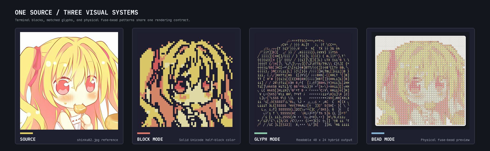
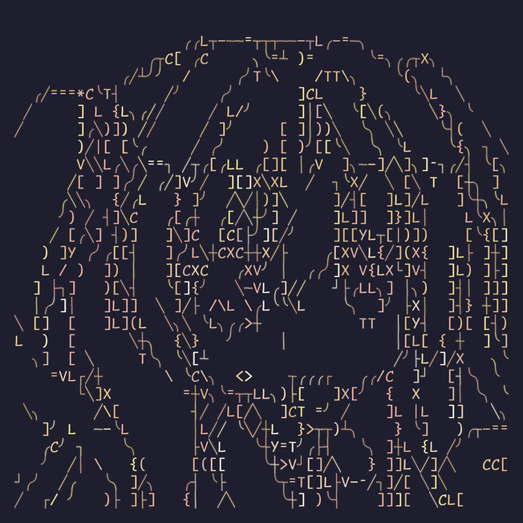
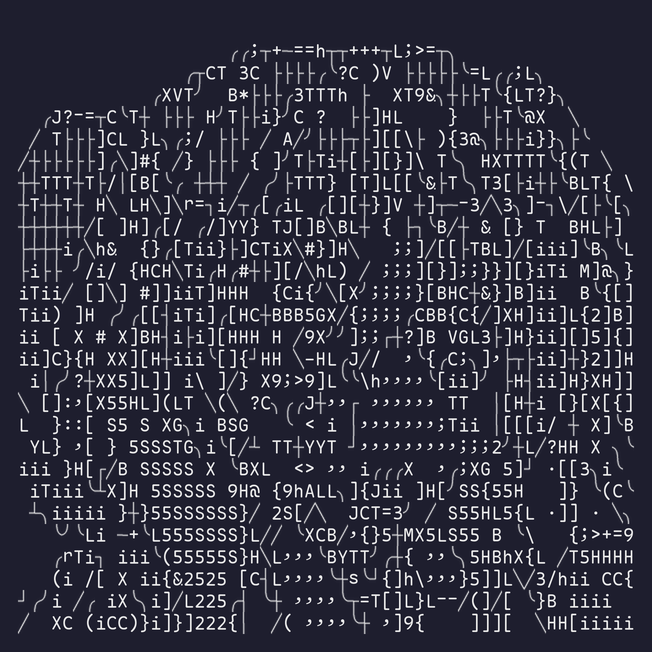
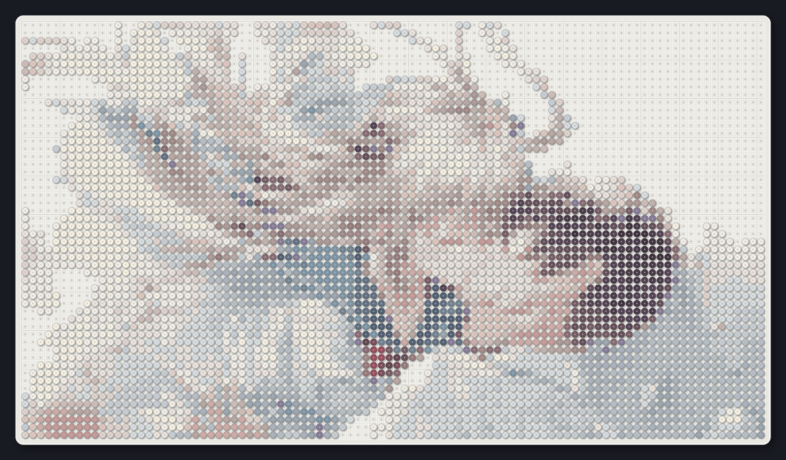
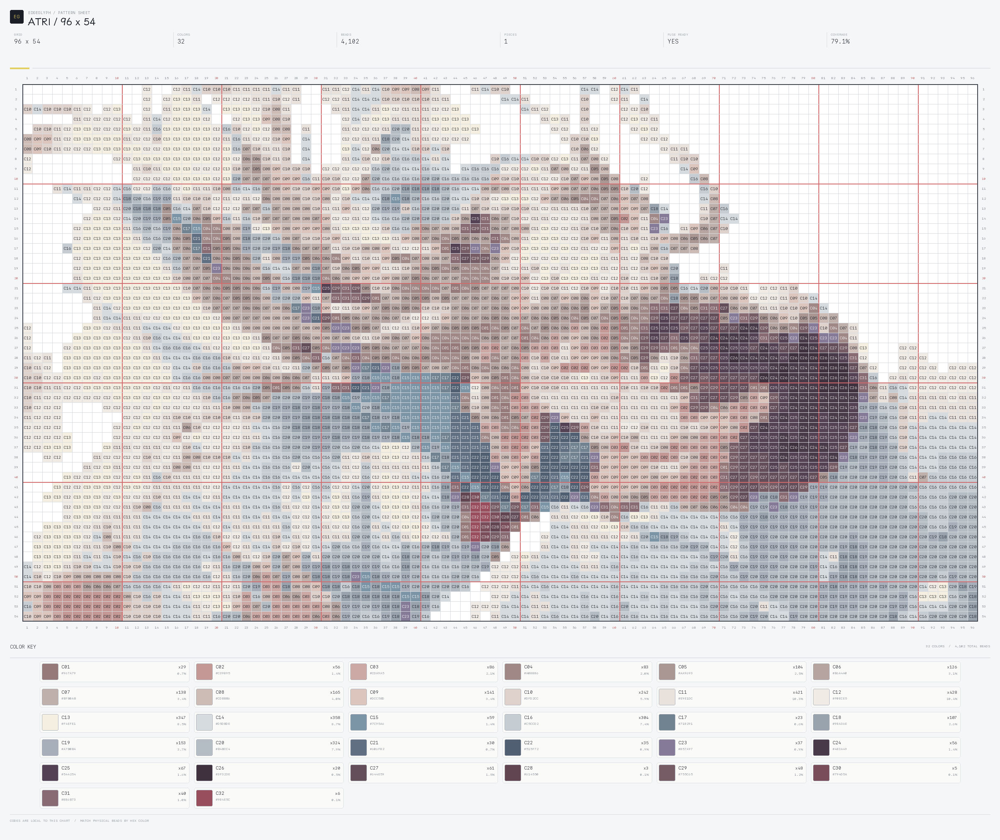

<p align="center"><picture><source media="(prefers-color-scheme: dark)" srcset="docs/assets/edgeglyph-logo-dark.svg"></picture></p>

<p align="center"><a href="README.md">English</a> · <strong>简体中文</strong></p>

<p align="center">
  <a href="https://github.com/BITnene465/edgeglyph/actions/workflows/ci.yml"></a>
  
  <a href="LICENSE"></a>
</p>

EdgeGlyph 将图像转换为终端色块画、字体匹配字符画和拼豆图纸。CLI、Python API、NvDash 导出器与本地工作台共用同一份参数定义。

<p align="center"></p>

| 模式 | 表示方法 | 主要输出 |
| --- | --- | --- |
| `block` | 空格与 Unicode `▀▄█` | 紧凑的终端彩色色块画 |
| `glyph` | 使用指定字体栅格化字符 | 彩色或黑白字符画 |
| `bead` | 一个正方形网格对应一颗拼豆 | 图纸、颜色统计、底板 PNG |

## 安装

```bash
git clone https://github.com/BITnene465/edgeglyph.git
cd edgeglyph
python3 -m venv .venv
source .venv/bin/activate
pip install -e .
```

需要 Python 3.10 或更高版本。运行时依赖为 NumPy 和 Pillow。

启动仅监听本机回环地址的工作台：

```bash
edgeglyph web
```

浏览器未自动打开时访问 `http://127.0.0.1:8765`。

## 字符模式

<p align="center">
  
  
</p>
<p align="center"><sub>彩色输出 · 黑白输出</sub></p>

彩色输出：

```bash
edgeglyph glyph input.png \
  --font /path/to/MapleMono-NF-Regular.ttf \
  --profile hybrid \
  --color-mode color \
  --cols 56 --rows 28 \
  --output output.txt \
  --preview output.png \
  --lua-output output.lua
```

用于纯文本 TTY 或不支持彩色 chunk 的终端：

```bash
edgeglyph glyph input.png \
  --font /path/to/MapleMono-NF-Regular.ttf \
  --profile hybrid \
  --color-mode mono \
  --mono-color '#e8e8e8' \
  --output output.txt \
  --preview output-mono.png
```

`mono` 只使用一种前景色，不生成单元格背景色。TXT 文件只包含 UTF-8 字符，显示时可直接沿用终端当前前景色。

### 字符参数

| 参数 | 可选值 | 默认值 |
| --- | --- | ---: |
| `--profile` | `outline`、`hybrid`、`tone` | `hybrid` |
| `--color-mode` | `color`、`mono` | `color` |
| `--mono-color` | `#RRGGBB` | `#e8e8e8` |
| `--character-preset` | `portrait`、`ascii`、`line`、`unicode` | `portrait` |
| `--fill-mode` | `auto`、`none`、`salient`、`tone` | `auto` |
| `--symbols` / `--fill-symbols` | 自定义结构字符与填充字符 | 使用预设 |
| `--symbols-file` / `--fill-symbols-file` | UTF-8 字符文件 | - |
| `--top-k` | 每个单元格保留的候选字符数 | `8` |

字符覆盖率、密度、区域墨迹、方向和纹理由所选字体实际计算。终端宽度不合法或字体缺失的字符会被排除。Unicode 预设推荐使用 Maple Mono NF 等 Nerd Font。

结构、色调、颜色、纹理和全局约束可以通过 `--shape-weight`、`--tone-weight`、`--color-weight`、
`--texture-weight` 与 `--global-weight` 调整。参数范围见 `edgeglyph glyph --help`。

## 色块模式

```bash
edgeglyph block input.png \
  --cols 72 --rows 24 \
  --colors 4 \
  --fit cover --focus-y 0.36 --zoom 0.9 \
  --output output.txt \
  --preview output.png
```

色块输出只使用空格与 `▀▄█`。每个终端单元格可以保存上下两个独立颜色。

## 拼豆模式

```bash
edgeglyph bead input.png \
  --cols 96 --rows 54 \
  --colors 32 \
  --background auto \
  --assembly single \
  --board-style light --finish matte \
  --bead-size 12 \
  --preview bead-pattern.png \
  --chart bead-chart.png \
  --chart-title 'ATRI / 96 x 54' \
  --chart-header detailed \
  --chart-cell-size 24 \
  --metrics bead-counts.json
```

<p align="center">
  
</p>
<p align="center">
  
</p>

该示例使用 `96 × 54` 网格和 `32` 种颜色，在保留横向构图与人物细节的同时，使颜色编号仍能在单张高分辨率施工图中阅读。

`--assembly single` 只保留最大的四邻域连通主体，使成品能够整片热熔；被移除的孤立豆数和原始区域数会写入统计。
只有在准备分别热熔并安装多个部件时才使用 `--assembly separate`。仅对角接触不算物理连接。

拼豆网格最高支持 `2048 × 2048`，调色板最多支持 `128` 色。大尺寸预览会缩小豆子的显示尺寸，不改变逻辑网格。
`--chart` 可导出带单格颜色编号、四边坐标、十格辅助线、热熔状态、规格统计和颜色占比的施工图。
`--chart-header` 支持 `detailed`、`compact` 和 `none` 三种页眉；`--chart-title` 设置名称，
`--chart-cell-size` 调整编号密度。

## 输出

| 参数 | 文件 |
| --- | --- |
| `-o`、`--output` | 纯 UTF-8 字符画 |
| `--preview` | PNG 渲染图 |
| `--chart` | 带颜色编号的拼豆施工图 PNG |
| `--lua-output` | NvDash 调色板与文本 chunk |
| `--metrics` | JSON 指标与拼豆颜色统计 |
| `--debug-dir` | 中间掩码和重建图 |

未指定 `--output` 时，字符画写入 stdout；指标写入 stderr。

查看完整参数：

```bash
edgeglyph block --help
edgeglyph glyph --help
edgeglyph bead --help
edgeglyph schema
```

## Python API

```python
from edgeglyph.modes import glyph

result = glyph.render(
    "input.png",
    "/path/to/MapleMono-NF-Regular.ttf",
    profile="hybrid",
    color_mode="mono",
    cols=56,
    rows=28,
)

print("\n".join(result.lines))
```

公开模式模块为 `edgeglyph.modes.block`、`edgeglyph.modes.glyph` 和 `edgeglyph.modes.bead`。

## 开发

```bash
PYTHONPATH=src pytest -q
python -m compileall -q src
python -m build
```

架构与渲染边界见 [docs/architecture.md](docs/architecture.md)，贡献规则见 [CONTRIBUTING.md](CONTRIBUTING.md)。

## 参考

- [Structure-based ASCII Art, ACM Transactions on Graphics, 2010](https://doi.org/10.1145/1778765.1778789)
- [Chafa](https://github.com/hpjansson/chafa)

## 许可证

[MIT](LICENSE)
